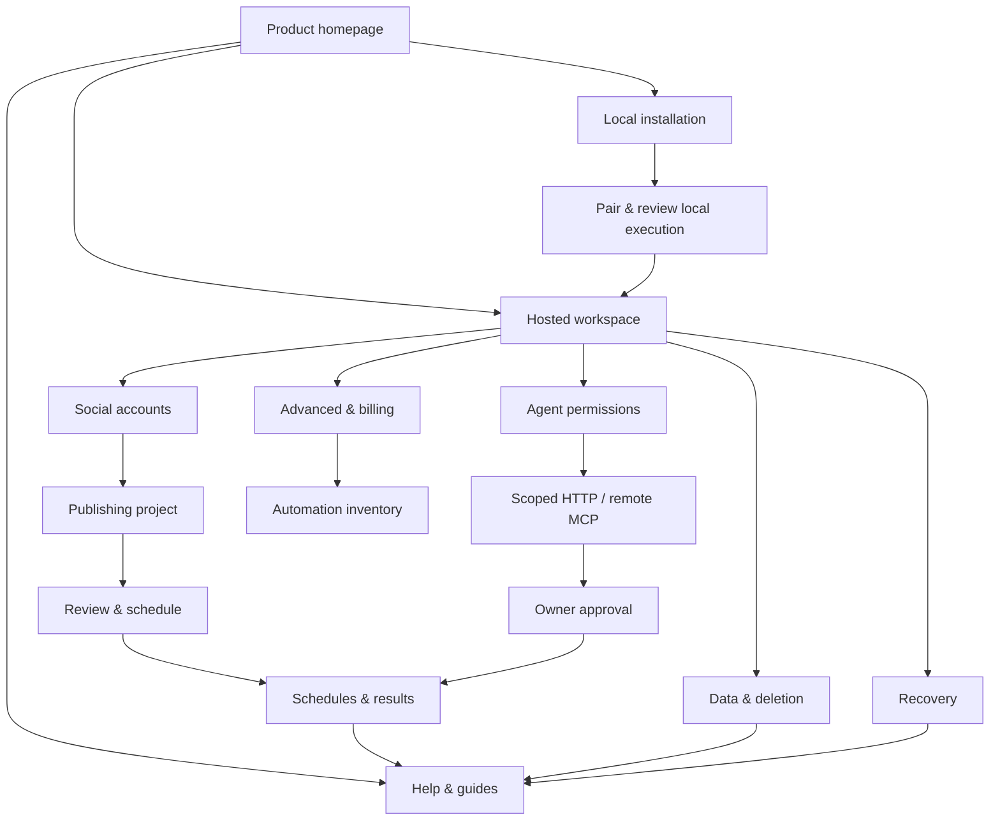

# PostSteward frontend orientation and connected journeys

Scope: production website on apex/www, public application/help pages, owner screens and their important states. Maintain cloud credential custody, one executor authority, scoped agent grants and owner review. No change to price, signup limits, provider access or entitlement policy.

## Experience map

| Audience / starting point | Destination and purpose | Next action / dependencies |
| --- | --- | --- |
| New visitor, homepage | Product definition, example flow, three starting choices, provider limits and Free/Advanced explanation | Hosted workspace needs Google sign-in; local use also needs Linux/Bash/Python 3.10+. Agent use is optional. |
| First-time owner, Get started | Account → project → reviewed post → result; optional agent setup after the owner path | OAuth to X/Threads; LinkedIn Page requires provider approval. Agent-created work needs owner approval. |
| Owner, workspace overview | Loaded-state next step and task navigation | Connect accounts, create/schedule, inspect results, manage grants or billing. Hidden forms until successful initial data load. |
| Returning owner, Schedules & results | Latest 50 receipts, state filter/search, exact copy, provider evidence and available recovery actions | Scheduled is a reservation. Unknown/ambiguous effects never imply success; inspect before repeating an effect. |
| Developer / agent, Help & guides | Task guides and direct installation, generated operation search, HTTP/MCP and raw discovery links | Authenticated scoped grant for operations; raw Markdown/JSON/OpenAPI remain directly accessible. |
| Local operator, Install → Local runtime | Canonical command, prerequisites, pairing, configuration, activation, executor selection and migration/recovery guidance | Initial installation inactive; reviewed handoff and activation; cloud authority fencing remains. WSL/macOS acceptance pending. |
| Advanced owner, Advanced & billing → Automation inventory | Reviewed source/templates, profile spacing, observations, reservations and billing controls | Entitlement + approved profile. GBP amount undecided and new checkout disabled until configured. Billing permission is distinct from payer consent. |
| Owner, Agent permissions | Scope/expiry/token issuance/revocation and private-source controls | Token shown once; original scope/expiry/revocation rechecked. A grant cannot approve its own publication. |
| Owner, Data & deletion | Retention/export/deletion and explicit confirmation | Consequential controls tested only in isolated fixtures; never run on a live customer for UX checks. |
| Operator, Recovery | Checkpoint evidence, reviewed restoration/reconciliation/resumption | Restoration cannot remove external-effect fences. A recovered local runtime needs cloud review before new authority. |
| Any visitor, Trust/support/status | Privacy, terms, security, deletion guidance, help and truthful runtime status | Public access; safe failure guidance, no secret details or invented availability. |
| Public demo / missing page / callback error | Inert sample or explicit error, next destination and support | Demo never becomes a real account or publishing action. Missing/callback states cannot imply successful sign-in. |

Website routes: `/`, `/install/`, `/onboarding/`, `/agent-guide/`, `/workspace/` (inert), `/privacy/`, `/terms/`, `/data-deletion/`, plus 404. Application routes: `/`, `/docs/`, `/docs/install`, `/docs/agent-guide`, `/docs/operations`, `/privacy`, `/terms`, `/security`, `/support`, `/status`, `/app`, `/advanced-inventory`, `/lifecycle`, `/recovery`, `/pilot` (operator/provider checks), `/auth/callback` missing-state and 404. HTML aliases canonicalise. Pricing is a homepage anchor. Owner action areas live within `/app` and have stable section links.

## Prioritised findings and acceptance

| ID / priority | Current-run evidence and affected journey | Implemented fix | Acceptance criterion |
| --- | --- | --- | --- |
| F1 / P1 | Signed-out `/app` screenshot: unusable runtime/forms before owner publishing overview | Header and task links first; forms gated until initial state loaded; actionable sign-in and retry states | No signed-out/stale populated authority, failed read not rendered as empty success, successful retry reveals current data |
| F2 / P1 | Owner fixture/source: settings/transport dominate first screen | Workspace next step from loaded accounts/projects/approval/paused state; runtime and transport details disclosed on request | Empty owner reaches accounts first; collapsed runtime still opens from a direct link and survives refresh |
| F3 / P1 | Mobile public secondary pages hide primary navigation; mobile workspace hides Refresh | Shared mobile menu on all public pages, docs menus on every human guide, visible mobile Refresh/Sign out | Keyboard/touch access; no overflow; menu closes on navigation/Escape; failed read has visible recovery control |
| F4 / P1 | Onboarding links to record-list/grant subregions rather than task starts | Link to project form, permission section, schedule/result task; consistent canonical HTML guide URLs | Every linked section exists, is focusable and has a clear heading; back/direct navigation remains usable |
| F5 / P2 | Labels “Data”, “Inventory”, “Acceptance”, “Control plane” require internal knowledge | Social accounts, Create & schedule, Schedules & results, Agent permissions, Advanced & billing, Automation inventory, Data & deletion; operator checks excluded from ordinary primary navigation | Owners can predict destination from label; current-location indication retained |
| F6 / P2 | Desktop hero at 1440px wraps into six lines and pushes actions to bottom of 900px view | Shared smaller type/gap/padding, aligned flow illustration and three visible starting choices | Brand retained; readable headline/actions and no horizontal overflow at narrow widths |
| F7 / P1 | Human docs lead with architecture language and release/rollout diagnostics; source links refer to absent recovery/lifecycle Markdown | Task-first help hub, owner task guidance and live destinations; diagnostics disclosed separately | First-time, returning owner and developer each find appropriate next action; broken help links removed |
| F8 / P2 | Onboarding centres agent tokens before the novice owner post task | Owner account/project/review path first; agent access optional; specialist code disclosed on request | No assumption that installation or an agent is required for hosted publishing; costs/permissions/limits still visible |
| F9 / P1 | Loading/session interruption and duplicate action risk | In-flight action guidance, single-batch refresh guard, fail-closed expiry hiding, bounded network waits and conservative error copy | Session expiry removes stale forms, read retry recovers, two refresh clicks trigger one batch; no automatic effect retry |
| F10 / P2 | Pending owner approval otherwise appears as unfamiliar receipt state | Explicit Needs owner approval badge/filter and next-step guidance | Approval remains an owner action; receipt status not promoted to publication |

## Research applied

- Microsoft Fluent official navigation/accessibility source: ordinary `href` links for navigation, named menu controls and separate navigation/disclosure semantics. Use native links/details; do not add a complex client router or introduce a framework to solve simple task navigation. [Navigation accessibility](https://github.com/microsoft/fluentui/blob/master/packages/react-components/react-nav/stories/src/Nav/NavAccessibility.md).
- Google Chrome's maintained Web Vitals project: measure loading, responsiveness and stability separately and distinguish lab from field data. Current guidance includes LCP, INP and CLS; this audit can measure bounded lab loading/CLS, not claim a field 75th percentile or conversion gain. [Official web-vitals README](https://github.com/GoogleChrome/web-vitals/blob/main/README.md). The retrieved older web.dev repository overview is explicitly historical (2023), not current INP guidance.
- W3C current source: reflow and minimum targets, combined with manual keyboard/focus inspection and axe checks. Responsive geometry and a scanner cannot establish full assistive-technology compliance. [Reflow](https://github.com/w3c/wcag/blob/main/understanding/21/reflow.html), [target size](https://github.com/w3c/wcag/blob/main/understanding/22/target-size-minimum.html).
- Direct Material, Fluent website, Apple HIG, W3C and web.dev page requests were blocked by environment egress. Retrieved official repository content is primary evidence; unavailable documentation is not represented as read.

## Verification and evidence boundary

Current-run screenshots and traces live under `/workspace/setup-logs/frontend-orientation/`. `before/` and `before-quality/` are fresh production captures; `fixture-before/` is the existing compiled Worker with synthetic owner records captured before changes. After captures must be generated from the final code/deployment and compared at the same widths. Old website/social audit artifacts are context, not fresh UX evidence.

The actual local compiled Worker is tested with synthetic read responses; external effects are forbidden. Browser checks cover initial-HTML metadata, image delivery, private query canaries, forms/feedback, receipt filters, unknown/ambiguous states, expired/revoked grants, provider layout, entitlement gates, sign-out/error states, keyboard/focus and narrow/dark rendering. New checks cover direct links, refresh/back, empty state, expiry, failed-read recovery and repeated refresh. Public website verification preserves the documentation-only boundary and installer/distribution/social metadata checks.

No real participant study was performed. No new live OAuth consent, provider publication, payer consent/charge, deletion or recovery is implied. Chromium desktop/touch simulations are available; Firefox/Safari and real devices/screen readers require separate validation. Official platform preview checks remain distinct from website metadata. Analytics source is unchanged; browser beacon observation alone is not trustworthy journey/conversion telemetry. Record unavailable analytics access and avoid improvement claims without data.

## Reusable novice testing script

Recruit a person who has not used PostSteward. Ask them to think aloud; do not point to the right control. Record first click, path, hesitation, error/recovery, completion and confidence. Use an isolated test workspace, not a live customer.

1. From the homepage, explain what PostSteward does, what you control and which providers have limitations.
2. Decide whether hosted use needs installation. Find the local command and explain the prerequisites without running it.
3. Find how to open a workspace, connect an account and create a project.
4. Find where to review and schedule exact copy; explain which agent actions need owner approval.
5. Find a scheduled and a verified receipt. Explain an ambiguous result and the safe next action.
6. Find agent permissions, their expiry/revocation and the integration guide.
7. Explain Free versus Advanced, find billing management and describe why checkout may be unavailable.
8. Find export/deletion and recovery guidance; stop before consequential actions.

Pass criterion: correct unaided destination, accurate interpretation of result/limits and a recoverable next action. Participant observations, measured task rates and confidence scores remain blank until real sessions occur.

Exact commits, completed CI/deployment runs, final screenshots and bounded performance/health results belong in the release evidence report after delivery. No claim of deployed or passed is made solely from this design/source document.
